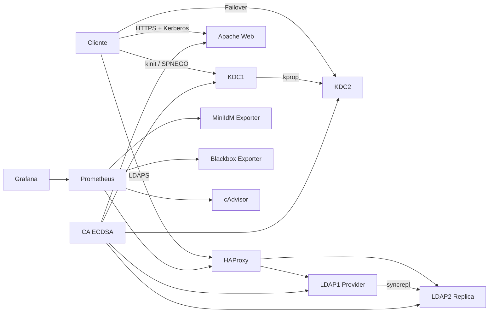

# MiniIdM FIS

Infraestructura segura de identidad para la Facultad de Ingeniería de Sistemas, implementada con OpenLDAP, MIT Kerberos, PKI ECDSA, HAProxy, Apache, Prometheus y Grafana.

> **Autor:** Ian Oñate  
> **Institución:** Escuela Politécnica Nacional    
> **Realm Kerberos:** `FIS.EPN.EC`  
> **Base LDAP:** `dc=fis,dc=epn,dc=ec`

---

## 1. Descripción del proyecto

Este proyecto implementa una infraestructura mínima de gestión de identidades, denominada **MiniIdM**, orientada a proporcionar autenticación, directorio de usuarios, cifrado, alta disponibilidad, balanceo de carga y monitoreo.

La solución integra:

- **OpenLDAP** para almacenar identidades.
- **MIT Kerberos** para autenticación centralizada.
- **PKI ECDSA** para certificados digitales.
- **HAProxy** para balanceo y continuidad del servicio LDAP.
- **Apache con GSSAPI/SPNEGO** para autenticación web mediante Kerberos.
- **Prometheus, Grafana, Blackbox Exporter y cAdvisor** para monitoreo.
- **Docker Compose** para desplegar todos los servicios.

---

## 2. Objetivos

### Objetivo general

Implementar una infraestructura segura de autenticación y directorio para la FIS, integrando Kerberos, PKI, LDAP, alta disponibilidad y monitoreo.

### Objetivos específicos

- Crear una autoridad certificadora propia con certificados ECDSA.
- Implementar OpenLDAP con replicación entre un proveedor y una réplica.
- Implementar dos servidores Kerberos con propagación de base.
- Integrar LDAP con Kerberos para validación de credenciales.
- Publicar un servicio web HTTPS protegido con Kerberos.
- Implementar balanceo de carga y failover mediante HAProxy.
- Monitorear disponibilidad, latencia y consumo de recursos.
- Ejecutar pruebas de seguridad, recuperación y rendimiento.

---

## 3. Arquitectura



---

## 4. Componentes

| Componente | Función |
|---|---|
| OpenLDAP | Directorio de identidades |
| LDAP1 | Proveedor principal |
| LDAP2 | Réplica de lectura |
| MIT Kerberos | Autenticación centralizada |
| KDC1 | KDC principal y servidor administrativo |
| KDC2 | KDC secundario |
| PKI ECDSA | Emisión y validación de certificados |
| HAProxy | Balanceo y continuidad del servicio LDAP |
| Apache | Servicio web HTTPS |
| mod_auth_gssapi | Autenticación web Kerberos |
| Prometheus | Recolección de métricas |
| Grafana | Visualización de métricas |
| Blackbox Exporter | Pruebas TCP, TLS y HTTP |
| cAdvisor | Métricas de contenedores |
| Docker Compose | Orquestación de servicios |

---

## 5. Estructura del proyecto

```text
miniidm/
├── compose.yaml
├── Makefile
├── .env.example
├── README.md
├── pki/
│   ├── Dockerfile
│   ├── scripts/
│   └── out/
├── kerberos/
│   ├── config/
│   ├── scripts/
│   ├── keytabs/
│   └── state/
├── ldap/
│   ├── Dockerfile
│   ├── scripts/
│   └── ldif/
├── haproxy/
│   └── haproxy.cfg
├── web/
│   ├── Dockerfile
│   ├── apache-site.conf
│   ├── entrypoint.sh
│   ├── index.html
│   ├── whoami.cgi
│   └── tls/
├── monitoring/
│   ├── prometheus.yml
│   ├── alerts.yml
│   ├── blackbox.yml
│   ├── exporter/
│   └── grafana/
├── client/
├── tests/
├── results/
├── scripts/
└── docs/
```

---

## 6. Requisitos

- Docker Desktop o Docker Engine.
- Docker Compose.
- Ubuntu o WSL2.
- OpenSSL.
- Python 3.
- Git.
- GNU Make.

Verificación rápida:

```bash
docker --version
docker compose version
openssl version
python3 --version
git --version
make --version
```

---

## 7. Configuración

Copiar el archivo de ejemplo:

```bash
cp .env.example .env
```

Editar el archivo:

```bash
nano .env
```

Variables principales:

```env
COMPOSE_PROJECT_NAME=miniidm

CA_KEY_PASSWORD=CAMBIAR

KRB_REALM=FIS.EPN.EC
KRB_MASTER_PASSWORD=CAMBIAR
KRB_ADMIN_PASSWORD=CAMBIAR
KRB_USER_PASSWORD=CAMBIAR

LDAP_DOMAIN=fis.epn.edu.ec
LDAP_BASE_DN=dc=fis,dc=epn,dc=ec
LDAP_ADMIN_PASSWORD=CAMBIAR
LDAP_REPL_PASSWORD=CAMBIAR

GRAFANA_ADMIN_USER=admin
GRAFANA_ADMIN_PASSWORD=CAMBIAR
```

> El archivo `.env` contiene información sensible y no debe publicarse.

---

## 8. Inicio de la infraestructura

Construir e iniciar:

```bash
docker compose up -d --build
```

O mediante Make:

```bash
make up
```

Verificar:

```bash
docker compose ps
```

Detener sin eliminar datos:

```bash
docker compose stop
```

Reiniciar:

```bash
docker compose restart
```

---

## 9. Puertos principales

| Servicio | Puerto local |
|---|---:|
| HAProxy LDAPS | `3636` |
| HAProxy estadísticas | `8404` |
| Web HTTPS | `8443` |
| cAdvisor | `8080` |
| Prometheus | `9090` |
| Blackbox Exporter | `9115` |
| MiniIdM Exporter | `9120` |
| Grafana | `3000` |

---

## 10. PKI y certificados

La PKI utiliza una autoridad certificadora propia con claves ECDSA.

Certificados emitidos para:

- `ldap1.fis.epn.edu.ec`
- `ldap2.fis.epn.edu.ec`
- `kdc1.fis.epn.edu.ec`
- `kdc2.fis.epn.edu.ec`
- `web.fis.epn.edu.ec`

Verificar un certificado:

```bash
openssl x509 \
  -in web/tls/web.cert.pem \
  -noout \
  -subject \
  -issuer \
  -dates \
  -ext subjectAltName
```

Validar contra la CA:

```bash
openssl verify \
  -CAfile web/tls/ca.cert.pem \
  web/tls/web.cert.pem
```

Resultado esperado:

```text
web/tls/web.cert.pem: OK
```

---

## 11. LDAP

### Base del directorio

```text
dc=fis,dc=epn,dc=ec
```

### Consulta directa a LDAP1

```bash
docker compose exec -T \
  -e LDAPTLS_CACERT=/pki/certs/fis-root-ca.cert.pem \
  client \
  ldapsearch \
    -x \
    -LLL \
    -H ldaps://ldap1.fis.epn.edu.ec \
    -b dc=fis,dc=epn,dc=ec \
    -s base \
    dn
```

### Consulta a través de HAProxy

```bash
docker compose exec -T \
  -e LDAPTLS_CACERT=/pki/certs/fis-root-ca.cert.pem \
  client \
  ldapsearch \
    -x \
    -LLL \
    -H ldaps://ldap.fis.epn.edu.ec \
    -b dc=fis,dc=epn,dc=ec \
    -s base \
    dn
```

---

## 12. Kerberos

### Realm

```text
FIS.EPN.EC
```

### Obtener un ticket

```bash
docker compose exec client kinit emafla
```

Verificar:

```bash
docker compose exec client klist
```

Eliminar:

```bash
docker compose exec client kdestroy
```

### Principales importantes

```text
emafla@FIS.EPN.EC
HTTP/web.fis.epn.edu.ec@FIS.EPN.EC
ldap/ldap1.fis.epn.edu.ec@FIS.EPN.EC
ldap/ldap2.fis.epn.edu.ec@FIS.EPN.EC
host/kdc1.fis.epn.edu.ec@FIS.EPN.EC
host/kdc2.fis.epn.edu.ec@FIS.EPN.EC
```

---

## 13. Replicación LDAP

LDAP1 funciona como proveedor y LDAP2 como réplica.

Tecnologías utilizadas:

- `syncprov`
- `syncrepl`
- `refreshAndPersist`
- `contextCSN`

Prueba:

```bash
./tests/test-ldap-replication.sh
```

Resultado obtenido:

```text
[EDITAR: retardo de replicación medido]
```

---

## 14. Alta disponibilidad Kerberos

KDC1 funciona como servidor principal y KDC2 como servidor secundario.

La base se propaga mediante:

```text
kdb5_util
kprop
kpropd
```

Prueba:

```bash
./tests/test-kdc-failover.sh
```

Resultado obtenido:

```text
[EDITAR: latencia de failover]
```

---

## 15. Servicio web HTTPS con Kerberos

Página pública:

```text
https://web.fis.epn.edu.ec:8443/
```

Página protegida:

```text
https://web.fis.epn.edu.ec:8443/secure/whoami
```

Prueba sin ticket:

```bash
docker compose exec -T client \
  curl \
    --cacert /pki/certs/fis-root-ca.cert.pem \
    -s \
    -o /dev/null \
    -w 'HTTP %{http_code}\n' \
    https://web.fis.epn.edu.ec/secure/whoami
```

Resultado esperado:

```text
HTTP 401
```

Prueba con Kerberos:

```bash
docker compose exec client kinit emafla

docker compose exec -T client \
  curl \
    --negotiate \
    -u : \
    --cacert /pki/certs/fis-root-ca.cert.pem \
    https://web.fis.epn.edu.ec/secure/whoami
```

Resultado esperado:

```text
Autenticación Kerberos exitosa
Usuario: emafla@FIS.EPN.EC
```

---

## 16. HAProxy

HAProxy distribuye conexiones entre LDAP1 y LDAP2 mediante round-robin.

Estadísticas:

```text
http://localhost:8404/stats
```

Métricas:

```text
http://localhost:8404/metrics
```

Verificar backends:

```bash
curl -s 'http://localhost:8404/stats;csv' |
awk -F, '
  /ldap1|ldap2/ {
    print "Servidor:", $2, "| Estado:", $18
  }
'
```

---

## 17. Monitoreo

### Prometheus

```text
http://localhost:9090
```

### Grafana

```text
http://localhost:3000
```

### cAdvisor

```text
http://localhost:8080
```

### Métricas principales

```promql
miniidm_ldap_up
miniidm_kerberos_up
miniidm_ldap_replication_lag_seconds
miniidm_kerberos_auth_duration_seconds
probe_success
```

### Estado rápido

```bash
curl -s http://localhost:9120/metrics |
grep -E \
  '^miniidm_(ldap_up|kerberos_up|ldap_replication_lag_seconds)'
```

---

## 18. Pruebas finales

Ejecutar todas:

```bash
make test
```

O individualmente:

```bash
./tests/test-ldap-replication.sh
./tests/test-kdc-failover.sh
./tests/test-tls-overhead.sh
./tests/test-haproxy-load.sh
./tests/test-kill9-recovery.sh
./tests/test-network-partition.sh
./tests/test-expired-certificate.sh
```

---

## 19. Resultados

| Prueba | Resultado |
|---|---|
| Replicación LDAP | [EDITAR] |
| Failover Kerberos | [EDITAR] |
| Sobrecarga TLS | [EDITAR] |
| Throughput HAProxy | [EDITAR] |
| Distribución HAProxy | [EDITAR] |
| Recuperación después de `kill -9` | [EDITAR] |
| Convergencia tras partición de red | [EDITAR] |
| Certificado vencido | [EDITAR] |

Resultados completos:

```text
results/phase11/resumen-final.txt
```

---

## 20. Seguridad

Medidas aplicadas:

- Certificados ECDSA.
- TLS para LDAP y web.
- Autenticación Kerberos.
- Keytabs con permisos restringidos.
- Contraseñas fuera del repositorio.
- Claves privadas excluidas mediante `.gitignore`.
- KDC secundario.
- Réplica LDAP.
- Rechazo de certificados vencidos.
- Monitoreo de disponibilidad.
- Pruebas de caída y recuperación.

Auditoría:

```bash
make audit
```

---

## 21. Makefile

Comandos disponibles:

```bash
make help
make up
make stop
make restart
make status
make logs
make validate
make test
make targets
make results
make audit
```

---

## 22. Publicación en GitHub

Inicializar:

```bash
git init
git branch -M main
```

Agregar archivos:

```bash
git add .
git commit -m "Implement secure MiniIdM infrastructure for FIS"
```

Configurar remoto:

```bash
git remote add origin \
  https://github.com/[USUARIO]/miniidm-fis.git
```

Si `origin` ya existe:

```bash
git remote set-url origin \
  https://github.com/[USUARIO]/miniidm-fis.git
```

Publicar:

```bash
git push -u origin main
```

---

## 23. Archivos sensibles excluidos

No deben publicarse:

```text
.env
*.key
*.key.pem
*.keytab
kerberos/state/
kerberos/replica-bootstrap/
pki/out/private/
monitoring/prometheus-data/
monitoring/grafana-data/
```

Comprobar:

```bash
git ls-files |
grep -Ei \
  '(^|/)\.env$|\.keytab$|\.key\.pem$|(^|/)stash$|/\.k5\.'
```

El comando no debe mostrar resultados.

---

## 24. Conclusiones

La implementación permitió integrar un directorio LDAP, autenticación Kerberos, certificados ECDSA, balanceo de carga y monitoreo dentro de una infraestructura reproducible con Docker Compose.

Las pruebas demostraron que:

- LDAP mantiene continuidad mediante una réplica.
- Kerberos continúa autenticando mediante KDC2 cuando KDC1 falla.
- TLS protege las comunicaciones.
- HAProxy distribuye las conexiones.
- Prometheus y Grafana detectan fallos y muestran métricas.
- La infraestructura puede recuperarse después de fallos controlados.

---

## 25. Apoyo externo

Se utilizó ChatGPT como apoyo para:

- Estructuración del proyecto.
- Depuración de errores.
- Elaboración de scripts.
- Diseño de pruebas.
- Documentación técnica.

Todos los comandos, configuraciones y resultados fueron ejecutados y verificados en el entorno local del proyecto.

---

## 26. Licencia

[EDITAR: indicar licencia o escribir “Uso académico”.]
